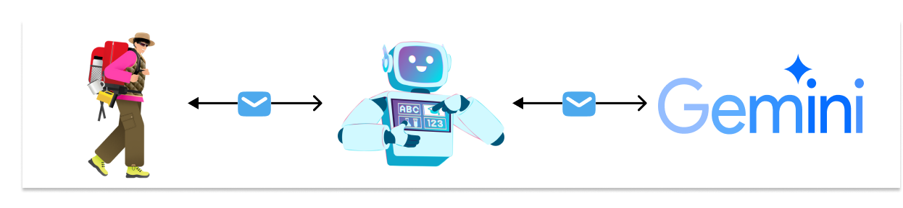
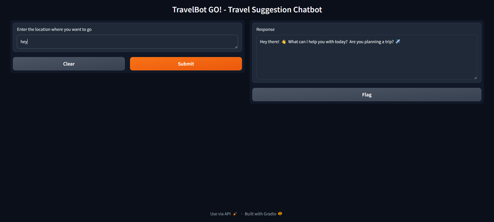
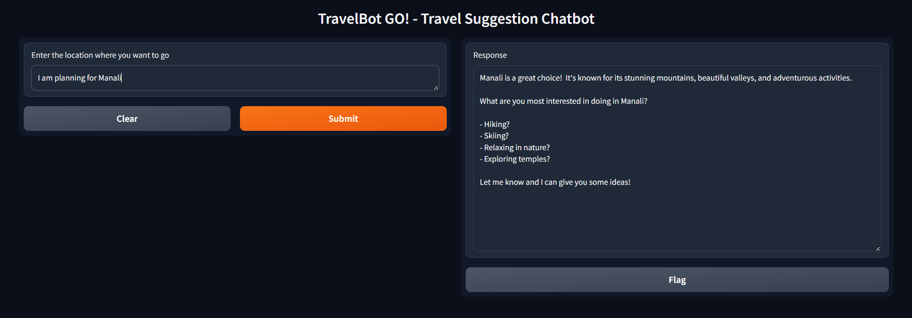
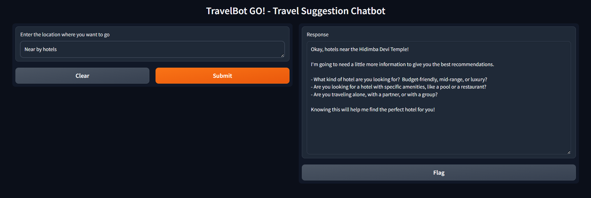
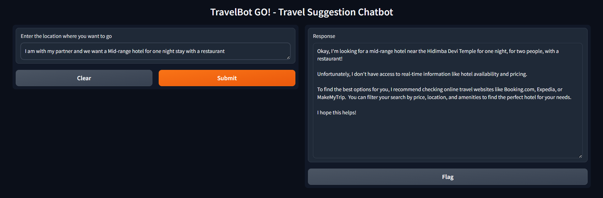

<h1>TripBot Go! 🤖</h1>

The chatbot project aims to create an intelligent travel assistant that suggests personalized travel destinations to tourists. Utilizing user preferences, interests, and travel history, it provides tailored recommendations to enhance the travel experience. The chatbot is built using Python and leverages Large Language Models (LLMs) to understand and process natural language inputs effectively, ensuring accurate and relevant destination suggestions.

<h2>Features</h2>

* User Interaction: The system ensures a seamless user experience through text  for travel inquiries and trip planning.

* Destination Recommendations: AI technology provides personalized destination suggestions based on user preferences and real-time data.

* Travel Tips: In addition to personalized recommendations, users receive essential guidance on  local cultures, and cuisines to enhance their travel experiences.

* Budget Planning: Tools for estimating and optimizing travel expenses with cost-saving recommendations and hotel links to manage budgets efficiently.

<h2>Technologies Used</h2>

  1. Python
  2. Gemini
  3. Gradio
  4. Colab

<h2>High level architecture diagram <h2>

<h1> Getting Started </h1>

</h2>Installation:</h2>

1. Clone the repository:

   `git clone <https://github.com/edquestofficial/TripBot> `
   
   `cd TripBot`

2. Virtual environment:
   
   `python -m venv tripbot-env  `
   
  Windows :  `venv\Scripts\activate  `
  Mac\Linux: `source myenv/bin/activate` 

3. Install the required packages:
   
   `pip install -r requirements.txt`

4. Create a .env file in the root directory of the project and define your Gemini API key:

   `echo API_KEY=your_api_key_here > .env`

<h2> Running the Bot </h2>

To start the bot, run the following command:

`python app.py`

<h2> Demo Video </h2>
Watch the demo video to see Burger bot in action:

   
<h2>Demo View</h2>

<h2> Feedback/ Query Form </h2>

share any query or feedback in this google form: [Feedback Form](link)
